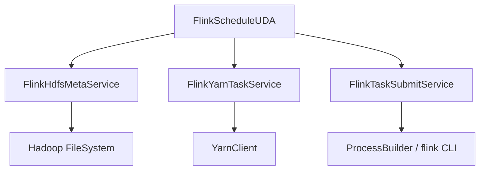
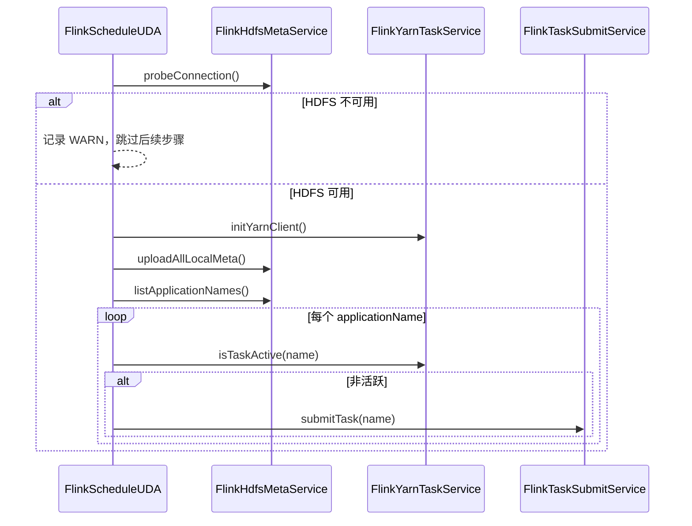

# FlinkScheduleUDA 设计文档

## 1. 背景与目标

CloudUDN CSP 服务需要在 HDP 集群上自动管理 Flink 插件任务的生命周期。运维人员将任务元数据放在本地目录，系统需将其同步到 HDFS，并根据 YARN 上的任务状态自动提交或拉起 Flink Application 模式任务。

### 1.1 功能目标

| 编号 | 需求 | 说明 |
|------|------|------|
| F1 | 元数据同步 | 定时读取 `/opt/cloududn/App/meta/flink` 下所有文件，上传到 `hdfs://hacluster/uda/plugin/flink` |
| F2 | 启动自检 | Bean 加载时探测 HDFS，扫描各 `applicationName` 子目录，查询 YARN 任务状态 |
| F3 | 任务提交 | 非活跃状态时通过 `flink run-application` 提交任务 |
| F4 | 周期保活 | 周期性检查所有 Flink 任务，异常退出时自动拉起 |

### 1.2 非功能目标

- 同一 `applicationName` 不重复并发提交
- HDFS 短暂不可用时支持自动重连
- 关键操作均有结构化日志，便于运维排查

---

## 2. 架构设计

### 2.1 模块划分

```
com.huawei.cloududn.cspservhdp.service.impl.flinkschedule
├── FlinkScheduleUDA          # 调度编排 Bean（定时任务 + 生命周期）
├── FlinkHdfsMetaService      # HDFS 探测、列举、元数据上传
├── FlinkYarnTaskService      # YARN 任务状态查询
├── FlinkTaskSubmitService    # Flink 命令拼装与执行
└── FlinkScheduleConstants    # 路径与状态常量
```

### 2.2 类职责

| 类 | 职责 |
|----|------|
| `FlinkScheduleUDA` | Spring Bean 入口，编排初始化、定时上传、定时巡检 |
| `FlinkHdfsMetaService` | HDFS 连通性探测、列举 application 目录、递归上传本地文件 |
| `FlinkYarnTaskService` | 通过 YarnClient 查询指定 applicationName 是否处于活跃状态 |
| `FlinkTaskSubmitService` | 拼装并执行 `flink run-application` 命令 |
| `FlinkScheduleConstants` | 本地/HDFS 路径、主类名、YARN 活跃状态集合 |

### 2.3 依赖关系



---

## 3. 核心流程

### 3.1 Bean 初始化流程



### 3.2 定时元数据上传

- 触发方式：`@Scheduled(cron)`，默认每 5 分钟
- 前置条件：HDFS 可用
- 行为：遍历本地 `/opt/cloududn/App/meta/flink/{applicationName}/`，递归上传到 HDFS 对应目录

### 3.3 定时任务保活

- 触发方式：`@Scheduled(fixedDelay)`，默认每 60 秒
- 前置条件：HDFS 可用
- 行为：列举 HDFS 上所有 application 子目录，逐一检查 YARN 状态，非活跃则提交

### 3.4 任务提交命令

```bash
flink run-application \
  -t yarn-application \
  -Dyarn.application.name={applicationName} \
  -c com.taskplugin.flink.FlinkTaskApplication \
  /opt/cloududn/App/lib/task-plugin-flink.jar \
  --task-path hdfs://hacluster/uda/plugin/flink/{applicationName}/
```

> `-Dyarn.application.name` 与 HDFS 子目录名保持一致，确保 YARN 查询可按名称匹配。

---

## 4. 目录与数据模型

### 4.1 本地目录结构

```
/opt/cloududn/App/meta/flink/
├── order-sync/          # applicationName
│   ├── task.json
│   └── config.yaml
└── user-event/
    └── task.json
```

### 4.2 HDFS 目录结构

```
hdfs://hacluster/uda/plugin/flink/
├── order-sync/
│   ├── task.json
│   └── config.yaml
└── user-event/
    └── task.json
```

### 4.3 YARN 活跃状态定义

以下状态视为“正在拉起或运行中”，**不触发重新提交**：

- `NEW`
- `NEW_SAVING`
- `SUBMITTED`
- `ACCEPTED`
- `RUNNING`

其余状态（如 `FINISHED`、`FAILED`、`KILLED`）或 YARN 上不存在该应用时，触发提交。

---

## 5. 配置项

在 `application.properties` 或等价配置中支持以下参数：

| 配置键 | 默认值 | 说明 |
|--------|--------|------|
| `flink.schedule.flink-bin` | `flink` | flink 可执行文件路径 |
| `flink.schedule.upload-cron` | `0 */5 * * * ?` | 本地 meta 上传 cron 表达式 |
| `flink.schedule.check-interval-ms` | `60000` | 任务状态巡检间隔（毫秒） |

### 5.1 Spring 启用定时任务

```java
@Configuration
@EnableScheduling
public class FlinkScheduleConfig {
}
```

---

## 6. 并发与容错

### 6.1 提交防重

- 每个 `applicationName` 维护独立 `ReentrantLock`
- 使用 `tryLock()`：若已有线程正在处理同一应用，当前轮次跳过并记录 INFO 日志

### 6.2 HDFS 容错

- 启动时 HDFS 不可用：记录 WARN，跳过初始化上传与任务检查
- 运行中 HDFS 恢复：`ensureHdfsReady()` 重新探测并初始化 YarnClient

### 6.3 YARN 查询失败

- 查询异常时返回 `false`（视为非活跃），下一轮巡检会尝试重新提交
- 避免因单次查询失败导致任务永久不被拉起

---

## 7. 日志规范

| 级别 | 使用场景 | 示例 |
|------|----------|------|
| INFO | 生命周期、业务关键节点 | Bean 初始化、上传完成、任务提交、YARN 状态命中 |
| WARN | 可恢复异常、跳过操作 | HDFS 不可用、本地目录不存在、任务非活跃需提交 |
| ERROR | 不可恢复错误 | HDFS 探测失败、上传失败、命令执行失败 |
| DEBUG | 调试细节 | 定时触发、单文件拷贝、YARN 查询入参 |

日志使用 SLF4J 懒插值格式：`LOG.info("Uploaded {} file(s) for application {}", count, name)`。

---

## 8. 测试策略

### 8.1 单元测试范围

| 测试类 | 覆盖点 |
|--------|--------|
| `FlinkScheduleUDATest` | 初始化流程、定时任务编排、HDFS 不可用分支、任务提交触发 |
| `FlinkHdfsMetaServiceTest` | 本地目录不存在、空目录、上传流程 |
| `FlinkYarnTaskServiceTest` | 活跃/非活跃状态判断、查询异常 |
| `FlinkTaskSubmitServiceTest` | 命令拼装、执行成功/失败 |

### 8.2 测试方式

- 使用 JUnit 4 + Mockito 对外部依赖（HDFS、YARN、Process）进行 Mock
- 不依赖真实集群环境
- 通过 `mvn test` 执行

### 8.3 集成测试建议（手工）

1. 在测试环境放置本地 meta 文件，观察 HDFS 同步结果
2. 手动 kill YARN 上 Flink 应用，验证自动拉起
3. 模拟 HDFS 短暂不可用后恢复，验证重连逻辑

---

## 9. 部署依赖

运行环境需提供：

| 组件 | 版本 |
|------|------|
| JDK | 21 |
| Spring Boot | 3.5.14 |
| Hadoop | 3.4.1 |
| Flink | 1.17.2 |
| JUnit（测试） | 4.13.2 |

运行时还需：

- Spring Boot Context（`@Service`、`@Scheduled`、`@PostConstruct`）
- Hadoop Client（FileSystem、YarnClient）
- Flink CLI（`flink` 命令在 PATH 或配置完整路径）
- SLF4J 日志实现

---

## 10. 后续扩展建议

- 支持按 application 配置独立的提交参数（并行度、内存等）
- 引入提交失败退避策略，避免频繁失败重试
- 将命令行提交改为 Flink REST / YARN REST 提交，减少对 shell 环境依赖
- 增加指标上报（上传文件数、提交次数、活跃任务数）
